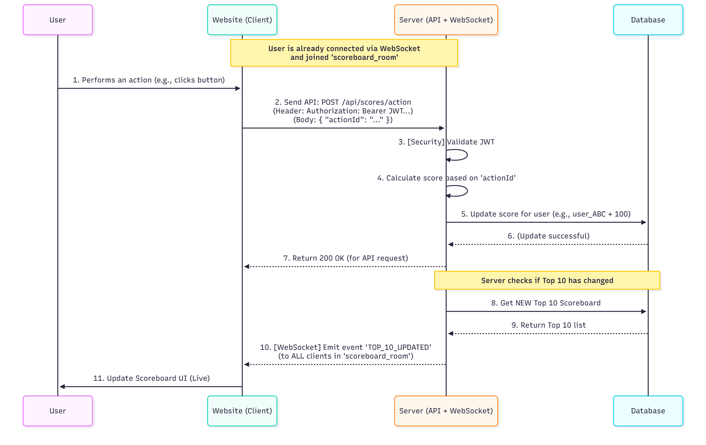

# Technical Specification: Live Scoreboard Service

This document outlines the architecture and technical design for the "Live Scoreboard" module on the backend server. This specification is intended for the Backend Engineering Team to implement.

## 1. Overview

This module is responsible for receiving and validating user score actions, updating scores in the database, and automatically pushing the latest Top 10 scoreboard to all connected clients in real-time.

## 2. Functional Requirements

1.  **Display Top 10:** The website must display a scoreboard of the top 10 users.
2.  **Live Updates:** The scoreboard must update in real-time when a score change affects the Top 10.
3.  **Update Score:** Users perform an action on the website.
4.  **API Call:** This action dispatches an API call to the backend to update the score.
5.  **Security:** Must prevent malicious users from increasing scores without authorisation.

## 3. Solution Architecture

We will combine a RESTful API (to receive scores) and a WebSocket (to push live updates).

### 3.1. Proposed Technology

-   **Server:** Node.js, Express.js (or NestJS for a robust structure).
-   **Live Updates:** `WebSockets` (using `Socket.IO` or `ws`).
-   **Authorisation:** `JWT (JSON Web Tokens)`.
-   **Database:** Any (e.g., PostgreSQL, MongoDB).
-   **(Improvement):** `Redis` (for scoreboard caching).

### 3.2. API Design: Update Score (Req. 4)

-   **Method:** `POST`
-   **Endpoint:** `/api/v1/scores/action`
-   **Header (Security):**
    -   `Authorization: Bearer <user_jwt_token>` (This is required for authentication).
-   **Body (JSON):**
    ```json
    {
      "actionId": "COMPLETED_LEVEL_5"
    }
    ```

### 3.3. Security & Authorisation (Req. 5)

We will use JWT to ensure only logged-in users can update THEIR OWN score.

### 3.4. Live Update Mechanism (Req. 2)

We will use `Socket.IO` for pushing data. Clients will join a `scoreboard_room` and the server will `emit` a `TOP_10_UPDATED` event to all clients in that room.

## 4. Execution Flow Diagram

Here's a flowchart that illustrates the entire process, from user action to "live" update.


## 5. Data model (example)

**model User** 
{
  id       String @id @default(cuid())
  username String @unique
  score    Int    @default(0) // The important field
}

## 6. Comments for Improvement

The following are additional recommendations for the engineering team to consider during implementation. While not strictly part of the core requirements, these improvements will significantly enhance the module's performance, scalability, and security.

### 1. Performance: Caching with Redis
-   **Problem:** Querying the main database (e.g., PostgreSQL) to get the Top 10 list *every time* a new score is submitted will be very slow and create a huge load on the database, especially with many concurrent users.
-   **Recommendation:** Use **Redis**, specifically a **"Sorted Set"**.
    -   When a score is updated, write it to *both* the main Database (for long-term storage) and the Redis Sorted Set.
    -   When clients need the new Top 10, the server should read directly from the Redis set. This operation is extremely fast (RAM-based) and is perfectly designed for leaderboard use cases.

### 2. Security: Rate Limiting
-   **Problem:** A malicious user or bot could spam the `POST /api/scores/action` endpoint thousands of times per second, either to cheat or to perform a Denial of Service (DDoS) attack on our server.
-   **Recommendation:** Implement **Rate Limiting** on this specific endpoint. For example, we could limit each authenticated `userId` to a maximum of 10 score updates per minute. This prevents abuse while still allowing legitimate gameplay.

### 3. Scalability: Asynchronous Job Queue
-   **Problem:** If the logic for calculating a score (e.g., checking for anti-cheat, validating the action) becomes complex, it will make the API response slow. The user will have to wait for the API call to finish.
-   **Recommendation:** Decouple the process using a **Job Queue** (e.g., RabbitMQ, Kafka, or a simple cloud queue).
    -   **Step 1 (Fast):** The API endpoint (`POST /api/scores/action`) should *only* validate the input and put a "job" (containing `userId` and `actionId`) into the queue. It then immediately returns a `202 Accepted` response.
    -   **Step 2 (Slow):** A separate "worker" service listens to this queue, processes the job (calculates score, updates DB, updates Redis), and then triggers the WebSocket event.
    -   **Benefit:** This makes the API endpoint feel instantaneous to the user and makes the system much more resilient to spikes in traffic.